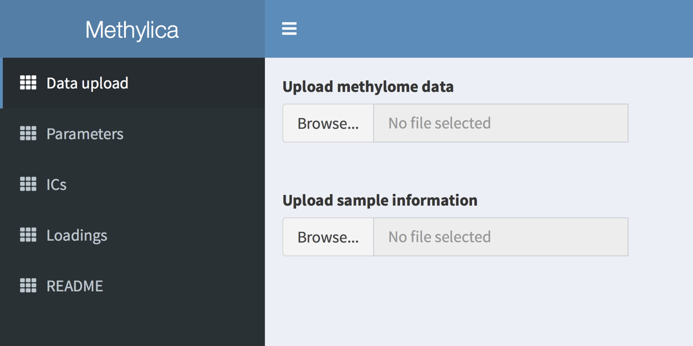

# Methylica
## A GUI tool for independent component analysis of methylome data
We have developed Methylica, a GUI-based tool for independent component analysis (ICA) of methylome data generated by either whole-genome bisulfite sequencing (WGBS) or Infinium methylation array. Methylica not only provides ICA-based sample clustering but identifies independent components (ICs), or methylomic signatures, specific to various subsets of the samples. Major contributors to a subset-specific IC serve as methylation markers of the subset and imply biological processes underlying the IC. Methylica would thus be a powerful tool to analyze samples composed of multiple subtypes, such as those of cancers.
 

## Install/Launch Methylica
1.  Install [R environment](https://www.r-project.org/)
2.  Install [shiny](https://shiny.rstudio.com).  
`install.packages("shiny")`
3.  Launch Methylica  
`shiny::runGitHub("HiromitsuAraki/Methylica")`
 

## Input file format
- Methylome data
  - 1st column: Chr
  - 2nd column: Start
  - 3rd column: End
  - 4th column: Gene symbol
  - 5th column ~ : Methylome data of each sample
   
- Sample meta data
  - 1st column: Sample ID
  - 2nd column ~ : Status of the features (e.g. cancer subtype, stage, gender)  
  **NOTE: The status of the features should be discrete, as Methylica cannot accept metadata with continuous values (e.g. age, tumor size, and survival date).**  
 

## Data uploading
Methylica requires methylome data and sample metadata as its inputs. The former is a matrix of methylation levels, rows and columns of which correspond to genomic regions and samples, respectively. The latter is a tab-delimited text file, rows and columns of which correspond to samples and features (e.g. gender, risk factor, and cancer subtype), respectively. The status of the features should be discrete, as Methylica cannot accept metadata with continuous values (e.g. age, tumor size, and survival date).

-   This figure will be shown once CNV "A004" is selected. Each dot represents a SNP probe, with X axis along chromosome coordination and Y axis showing normalized LRR and BAF.
-   Two red vertical lines indicate the reported breakpoints of selected CNV, which is obviously correct according to the figure.
-   The RefSeq genes are shown as bars at the bottom panel, and the COSMIC cancer genes are marked in red. Detailed gene information could be checked by clicking. E.g., the red bar is clicked and the information of gene *ETV6* is shown at the bottom.
-   To change the breakpoints of selected CNV, users could zoom in BAF/LRR graph by mouse-swiping and zoom out through the "Zoom out 2/5/10X" buttons. After clicking a potential breakpoint in BAF/LRR panel, chromosome position of the SNP nearest to the clicked spot will be shown in box "Pos:" and the start/end positions could be updated by "Set Start/End" buttons.
-   In case of marking whole chromosome gain/loss, users need the start and end positions of that chromosome. To do this, the dropdown list "Chr:" is very handy. Usually the start of each chromosome is 1, but for chromosome 13, 14, 15, 21 and 22, the P arm is not assessable and thus would start from cytoband after centromere.
-   “Padding X” drop-list is for adjusting the length of padding regions around the CNV
-   “maxSNP” drop-list is for setting maximum number of SNPs shown in each BAF/LRR panel
-   **NOTE: Any update to the CNV table will be saved in "cnv.bak" file under the App's folder.**

CNV spectrum for imported samples
---------------------------------

After loading SNP data, LRR across genome will be shown in the spectrum panel below:

-   Blue means LRR is below 0 (copy number loss) while red means above 0 (copy number gain).
-   Case IDs are on the left side and chromosomes are on the top.
-   Genders are marked at the right side: pink for female; skyblue for male.
-   Based on LRR intensity on X and Y chromosomes, gender information could be checked.
-   Within this panel, mouse-swiping zoom in is **NOT** supported.
-   “Show CNV” and “Hide CNV” buttons are provided to show and hide the imported CNVs as bars at the bottom of each sample.
    -   copy-neutral loss of heterozygosity: **green** 
    -   1 copy loss: **light blue** 
    -   2 copy loss (0 copy left): **dark blue** 
    -   1 copy gain: **red** 
    -   2 or more copy gain: **dark red** 
    -   selected CNV (see below): **magenta** 

Users could navigate to specific chromosome, gene, region through input box "Chr/Gene":

-   "Chr/Gene" accepts:
    -   chromosomes: "1-22, X, Y"
    -   gene symbol: e.g. "TP53"
    -   region: "12:11329569-13134790"
-   The input type is automatically detected, and if it cannot fit into any of the 3 types, whole genome spectrum will be shown.
-   Within the figure, mouse-swiping zoom in is supported.
-   Genes from RefSeq are shown as bars at bottom, and the COSMIC cancer genes are highlighted in red.
-   This figure is useful for checking key focal lesions like *IKZF1*, *CDKN2A/B*, *PAX5* etc.

###### ----------------------------END----------------------------
