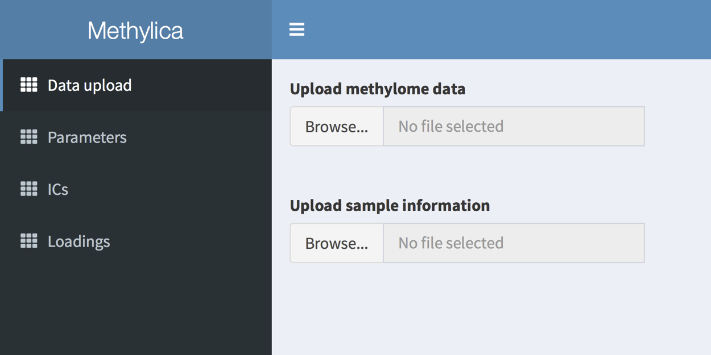

# Methylica
## GUI tool for independent component analysis of methylome data
Methylica is a GUI-based tool for independent component analysis (ICA) of methylome data generated by either whole-genome bisulfite sequencing (WGBS) or Infinium methylation array. Methylica not only provides ICA-based sample clustering but identifies independent components (ICs), or methylomic signatures, specific to various subsets of the samples. Major contributors to a subset-specific IC serve as methylation markers of the subset and imply biological processes underlying the IC. Methylica would thus be a powerful tool to analyze samples composed of multiple subtypes, such as those of cancers.
 

## Install/Launch Methylica
1.  Install [R environment](https://www.r-project.org/)
2.  Install [shiny](https://shiny.rstudio.com).  
`install.packages("shiny")`
3.  Launch Methylica  
The following R code will launch Methylica.  
`shiny::runGitHub("HiromitsuAraki/Methylica")`
 

## Input file format
Methylica requires methylome data and sample metadata as its inputs. The former is a matrix of methylation levels, rows and columns of which correspond to genomic regions and samples, respectively. The latter is a tab-delimited text file, rows and columns of which correspond to samples and features, respectively.
- Methylome data
  - 1st column: Chr
  - 2nd column: Start
  - 3rd column: End
  - 4th column: Gene symbol
  - 5th column ~ : Methylome data of each sample
   
- Sample meta data
  - 1st column: Sample ID
  - 2nd column ~ : Status of the features (e.g. cancer subtype, stage, gender)  
  **NOTE: The status of the features should be discrete, as Methylica cannot accept metadata with continuous values (e.g. age, tumor size, and survival date).**  
 

## Implementations
### Data uploading
Methylica requires methylome data and sample metadata as its inputs. Please refer **Input file format** about the file format of methylome data and sample metadata. Users need to assign the file location from a browser.

 

### Parameter setting
Following data upload, Methylica requests its users to select species with its reference genome version, genomic elements to be analyzed (CpG island, gene body, first intron and promoter), and k or the number of ICs (minimum = 2; maximum = the number of samples). Methylica provides a default setting of k, defined as the first k components whose cumulative contribution ratio exceeds 80% in principal component analysis. When users select all parameters, users need to click "Run" button to start 

 

### Visualization ICs
#### Heatmap clustering of ICs
When ICA is completed, Methylica provides a heatmap of clustering based on the mixing coefficient matrix A (Figure 1B), boxplots to compare weightings among the user-defined group categories (Figure 1C), and a table of loading values comprising each IC (Figure 1D). 

 

#### Boxplots
Methylica requires methylome data and sample metadata as its inputs. The former is a matrix of methylation levels, rows and columns of which correspond to genomic regions and samples, respectively. The latter is a tab-delimited text file, rows and columns of which correspond to samples and features (e.g. gender, risk factor, and cancer subtype), respectively. The status of the features should be discrete, as Methylica cannot accept metadata with continuous values (e.g. age, tumor size, and survival date).

 

#### Loading factor table
Methylica requires methylome data and sample metadata as its inputs. The former is a matrix of methylation levels, rows and columns of which correspond to genomic regions and samples, respectively. The latter is a tab-delimited text file, rows and columns of which correspond to samples and features (e.g. gender, risk factor, and cancer subtype), respectively. The status of the features should be discrete, as Methylica cannot accept metadata with continuous values (e.g. age, tumor size, and survival date).

 

### Highliting highly contributed regions
#### Heatmap clustering of highly contributed regions
Methylica requires methylome data and sample metadata as its inputs. The former is a matrix of methylation levels, rows and columns of which correspond to genomic regions and samples, respectively. The latter is a tab-delimited text file, rows and columns of which correspond to samples and features (e.g. gender, risk factor, and cancer subtype), respectively. The status of the features should be discrete, as Methylica cannot accept metadata with continuous values (e.g. age, tumor size, and survival date).

 

#### Loading factor table of highly contributed regions
Methylica requires methylome data and sample metadata as its inputs. The former is a matrix of methylation levels, rows and columns of which correspond to genomic regions and samples, respectively. The latter is a tab-delimited text file, rows and columns of which correspond to samples and features (e.g. gender, risk factor, and cancer subtype), respectively. The status of the features should be discrete, as Methylica cannot accept metadata with continuous values (e.g. age, tumor size, and survival date).

 

#### Boxplots of highly contributed region
Methylica requires methylome data and sample metadata as its inputs. The former is a matrix of methylation levels, rows and columns of which correspond to genomic regions and samples, respectively. The latter is a tab-delimited text file, rows and columns of which correspond to samples and features (e.g. gender, risk factor, and cancer subtype), respectively. The status of the features should be discrete, as Methylica cannot accept metadata with continuous values (e.g. age, tumor size, and survival date).

 
